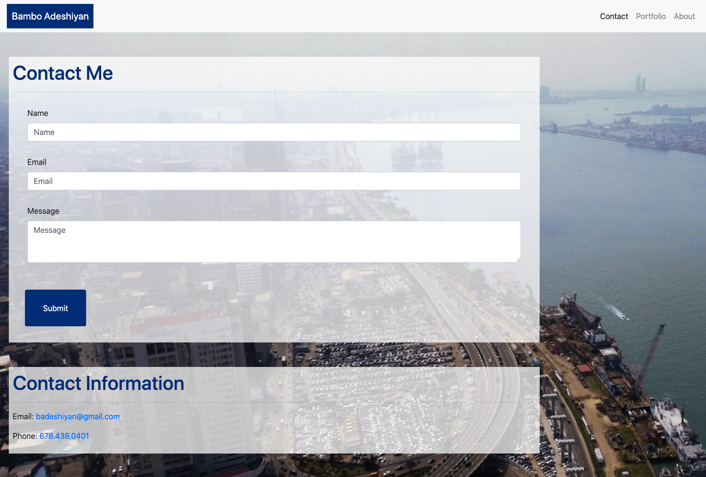
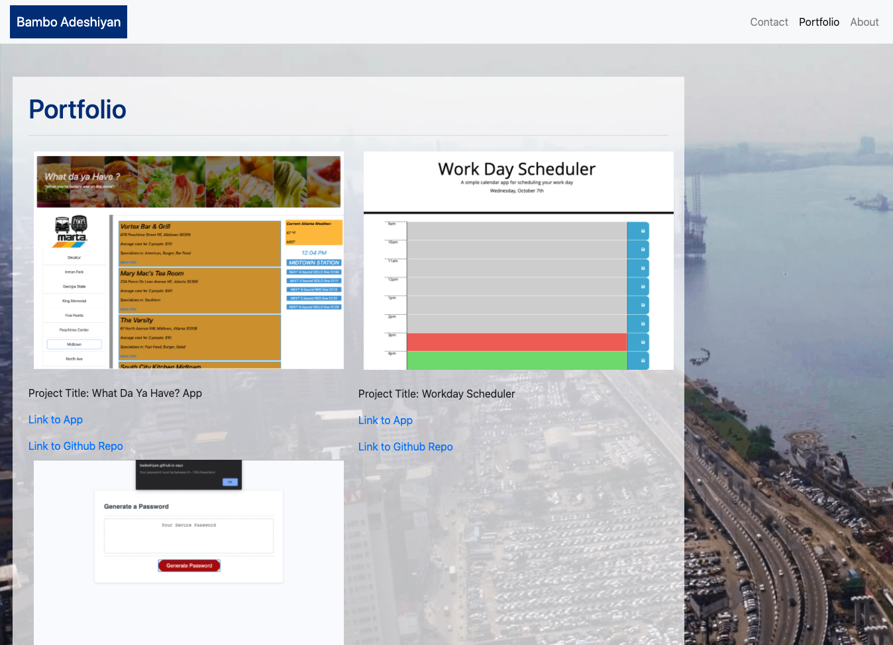
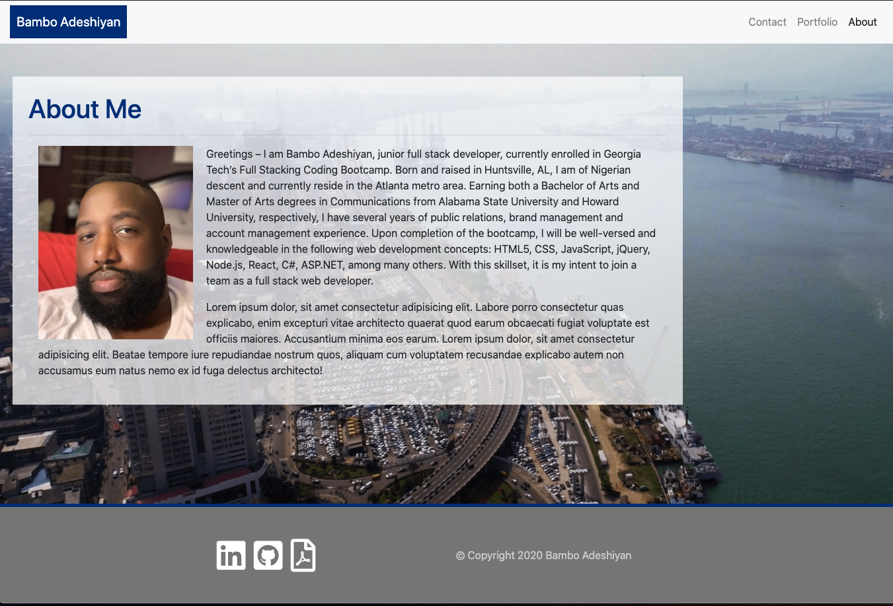

### bamboadeshiyan-portfolio-2020 - Responsive Portfolio

## Overview:

It is imperative that the source code written for a web page/application allows said page to be viewed appropriately, regardless of the type of device OR the different sizes of the window or screen being used at the time. This project involved the creation of the developer's personal portfolio and the utilization of responsive design to ensure that, again, the portfolio's web page(s) can be viewed correctly on either a desktop, tablet or even a mobile device. In order to achieve the aforementioned, the developer's steps included creating the html, adding bootstrap and css style links to said html, creating a separate css stylesheet; the majority of the work involved the styling of the web pages, and the use of containers, columns, rows and other css tools.

Using provided screenshots as guide for the intended portfolio, the developer utilized the tools learned from bootstrap, html and css basics,

## Deployed Webpage Link

Please find the deployed webpage link here:
https://badeshiyan.github.io/bamboadeshiyan-portfolio-2020/

## Screenshots of Deployed Webpage:







## Credits

1. W3schools: https://www.w3schools.com/tags/att_global_class.asp

2. Bootstrap: https://getbootstrap.com/

3. Porfolio Placeholder Images: http://placehold.it/350x350

## MIT License

Copyright (c) [2020] [Adebambo Adeshiyan]

Permission is hereby granted, free of charge, to any person obtaining a copy
of this software and associated documentation files (the "Software"), to deal
in the Software without restriction, including without limitation the rights
to use, copy, modify, merge, publish, distribute, sublicense, and/or sell
copies of the Software, and to permit persons to whom the Software is
furnished to do so, subject to the following conditions:

The above copyright notice and this permission notice shall be included in all
copies or substantial portions of the Software.

THE SOFTWARE IS PROVIDED "AS IS", WITHOUT WARRANTY OF ANY KIND, EXPRESS OR
IMPLIED, INCLUDING BUT NOT LIMITED TO THE WARRANTIES OF MERCHANTABILITY,
FITNESS FOR A PARTICULAR PURPOSE AND NONINFRINGEMENT. IN NO EVENT SHALL THE
AUTHORS OR COPYRIGHT HOLDERS BE LIABLE FOR ANY CLAIM, DAMAGES OR OTHER
LIABILITY, WHETHER IN AN ACTION OF CONTRACT, TORT OR OTHERWISE, ARISING FROM,
OUT OF OR IN CONNECTION WITH THE SOFTWARE OR THE USE OR OTHER DEALINGS IN THE
SOFTWARE.

```

```
